## Conceptual Model

The diagram presents a high-level conceptual view of the flight delay analysis domain.  
The central business object is **Flight**, which is described by operational, temporal, geographic, weather-related, and disruption-related elements.  

This model is intentionally non-technical.  
It does not show database tables, keys, or data types.  
Instead, it reflects how we understand the domain and which factors may influence flight delays and cancellations.

```mermaid
graph TD
    Flight((Flight))

    Airline((Airline))
    FlightNumber((Flight Number))
    OriginAirport((Origin Airport))
    DestinationAirport((Destination Airport))
    DepartureCity((Departure City))
    ArrivalCity((Arrival City))
    DepartureTime((Departure Time))
    ArrivalTime((Arrival Time))
    ScheduledTime((Scheduled Time))
    ActualTime((Actual Time))
    Date((Date))
    DayOfWeek((Day of Week))
    Month((Month))
    Season((Season))
    Weather((Weather))
    Temperature((Temperature))
    Wind((Wind))
    Visibility((Visibility))
    RainSnow((Rain / Snow))
    Aircraft((Aircraft))
    Delay((Delay))
    DepartureDelay((Departure Delay))
    ArrivalDelay((Arrival Delay))
    DelayReason((Delay Reason))
    CarrierDelay((Carrier Delay))
    WeatherDelay((Weather Delay))
    SecurityDelay((Security Delay))
    LateAircraftDelay((Late Aircraft Delay))
    NASDelay((NAS Delay))
    Cancellation((Cancellation))
    CancellationReason((Cancellation Reason))
    Diversion((Diversion))
    Distance((Distance))
    FlightDuration((Flight Duration))
    Route((Route))
    AirportTraffic((Airport Traffic))

    Flight --- Airline
    Flight --- FlightNumber
    Flight --- OriginAirport
    Flight --- DestinationAirport
    Flight --- DepartureCity
    Flight --- ArrivalCity
    Flight --- DepartureTime
    Flight --- ArrivalTime
    Flight --- ScheduledTime
    Flight --- ActualTime
    Flight --- Date
    Flight --- DayOfWeek
    Flight --- Month
    Flight --- Season
    Flight --- Weather
    Weather --- Temperature
    Weather --- Wind
    Weather --- Visibility
    Weather --- RainSnow
    Flight --- Aircraft
    Flight --- Delay
    Delay --- DepartureDelay
    Delay --- ArrivalDelay
    Delay --- DelayReason
    Delay --- CarrierDelay
    Delay --- WeatherDelay
    Delay --- SecurityDelay
    Delay --- LateAircraftDelay
    Delay --- NASDelay
    Flight --- Cancellation
    Cancellation --- CancellationReason
    Flight --- Diversion
    Flight --- Distance
    Flight --- FlightDuration
    Flight --- Route
    Flight --- AirportTraffic
```

